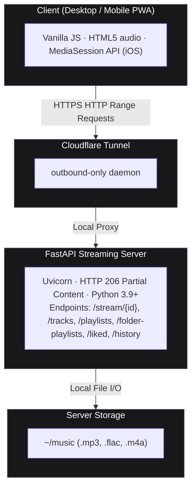

# ┌─────────────────────────────────────────────────┐
# │    # Sovereign Music :: personal music server   │
# └─────────────────────────────────────────────────┘
# Sovereign Music

A lightweight, self-hosted personal audio streaming service designed to operate efficiently on low-resource home servers. Sovereign serves local music directories to web browsers and standalone Progressive Web App (PWA) clients over secure, externally routable Cloudflare Tunnels without requiring open inbound router ports, static public IPs, or dynamic DNS setups.

The backend is built with Python and FastAPI, serving chunked audio streams via HTTP Range Requests (RFC 7233) for instant seek operations and minimal memory overhead. The frontend is built in Vanilla JavaScript, Tailwind CSS, and the HTML5 `<audio>` API, integrating deep OS-level playback controls via the MediaSession API (including lock-screen metadata and artwork for iOS Safari PWA and Android).

---
## Architecture Overview

Data Flow: Client Request → Cloudflare Edge → Local cloudflared Daemon → FastAPI Server (0.0.0.0:8005) → File System Storage. 
---

## Key Features
- **Continuous Background Playback & iOS Lock-Screen Controls** - Implements `navigator.mediaSession` with absolute HTTPS URI artwork and multi-resolution metadata mapping (96x96 through 512x512). Handles iOS WebKit background restrictions by keeping the audio thread active across track transitions.


- **HTTP Range Requests (RFC 7233)** The `/stream/{id}` endpoint parses incoming `Range` headers, performs byte-offset arithmetic, and streams chunks using FastAPI.responses.StreamingResponse with HTTP 206 Partial Content.

- **Smart Balanced Shuffle (Dither Algorithm)** Distributes tracks across the queue by artist to prevent playback clumping while maintaining random variety.

- **Stealth Dark 3-Panel Layout**
    `Left Sidebar:` Playlist and album directory browser with thumbnail artwork.
    `Central Stage:` Dynamic greeting, quick-access tiles, hero track preview, and curated album carousels.
    `Right Sidebar:` Persistent Now Playing View displaying high-resolution cover art, artist details, and track metadata.

- **PWA Standalone Mode** Manifest configuration supporting borderless standalone window execution on iOS, macOS, Android, Linux, and Windows.

- **Global Desktop Shortcuts** Direct keyboard-driven playback control without requiring tab focus.


> [!WARNING]
> **Security Notice:** Sovereign Music does not implement internal user authentication by default. When publishing your service through a Cloudflare Tunnel, it is strongly recommended to protect your domain using Cloudflare Zero Trust / Access (One-Time PIN or OAuth) to prevent unauthorized access and protect your bandwidth.


## Prerequisites

- **Operating System** Linux (Ubuntu/Debian recommended), macOS, or Windows.
- **Runtime** Python ≥ 3.9.
- **Network & Tunneling** A free Cloudflare account with the cloudflared daemon installed.

## Installation

**Clone Repository**
```sh
git clone https://github.com/jenriquecdev/stream.local.git
cd stream.local
```

**Configure Virtual Environment**
```sh
python3 -m venv .venv
source .venv/bin/activate
(On Windows: .venv\Scripts\activate) 
```

**Install Python Dependencies**
```sh
pip install --upgrade pip
pip install -r requirements.txt
```

**Configuration**
Create a .env file in the project root directory:

```sh
# Absolute path to your server's local audio files
MUSIC_DIR=/home/user/music

# Network binding
HOST=0.0.0.0
PORT=8005

# Cloudflare Tunnel Configuration
TUNNEL_NAME=music-tunnel
CORS_ORIGINS=https://music.example.com
```
**Execution**
Run Locally (Development)
```sh
uvicorn main:app --host 0.0.0.0 --port 8005 --reload
```
**Run as a Background Service (Production)**
```sh
nohup uvicorn main:app --host 0.0.0.0 --port 8005 > uvicorn.log 2>&1 &
```
**To stop the background process:**
```sh
pkill -f "uvicorn main:app"
```
# Cloudflare Tunnel Setup

**Authenticate the daemon:**
```sh
cloudflared tunnel login
```
**Create Tunnel**
```sh
cloudflared tunnel create music-tunnel
```
**Associate DNS / Route Traffic:**
Route your public hostname directly to the local port:
```sh
cloudflared tunnel route dns music-tunnel music.example.com
```
**Launch the tunnel:**
```sh
cloudflared tunnel run --url http://127.0.0.1:8005 music-tunnel
```
# Keyboard Shortcuts (Desktop)

| Shortcut      | Description                                |
| ------------- | -------------------------------------------|
| Space         | Play/ pause Playback                       |
| ArrowRight    | Next Track                                 |
| ArrowLeft     | previous Track (or restart current if>4s)  |
| ArrowUp       | Volume Up (+5%)                            |
| ArrowDown     | Volume Down (-5%)                          |
|     M         | Mute/ Unmute Audio                         |


# License

This project is licensed under the MIT License.# SovereignMusic
